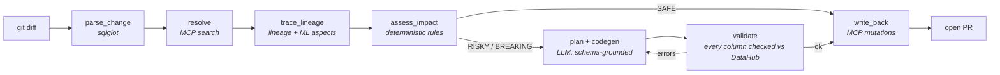

# Fuse

**The blast-radius agent for DataHub.** Fuse reads a schema change in your data repo, walks DataHub to find what actually breaks - including the ML feature and the production deployment that ordinary lineage won't show you - then writes the remediation code, opens a PR, and records the verdict back in the catalog.

[](https://github.com/BriceZemba/fuse-datahub/actions/workflows/ci.yml)
[](https://github.com/BriceZemba/fuse-datahub/actions/workflows/selftest.yml)
[](LICENSE)

> Built for [Build with DataHub: The Agent Hackathon](https://datahub.devpost.com/).

---

## Try it in 60 seconds - no Docker, no DataHub, no API key

```bash
pip install -e . && fuse replay examples/03-ml-feature-break
```

Every DataHub response is recorded in `examples/*/fixtures/`, so the full pipeline runs offline and reproduces the committed artifacts exactly. CI runs this too, so it cannot rot.

## What one run looks like

Someone drops `credit_limit` from a dbt model. Nine of 32 downstream assets need attention:

| Asset | Type | Hops | Severity | Score | Evidence |
|---|---|---|---|---|---|
| `credit_limit` | mlFeature | 1 | **BREAKING** | 90 | built on customers.credit_limit |
| `customer_churn_model` | mlModel | 2 | **BREAKING** | 67 | built on customers.credit_limit |
| `prod-retention-service` | mlModelDeployment | 3 | **BREAKING** | 64 | built on customers.credit_limit, **not returned by lineage** |
| `customer_churn_features` | mlFeatureTable | 2 | **BREAKING** | 62 | built on customers.credit_limit, **not returned by lineage** |
| `country_id` | mlFeature | 1 | RISKY | 55 | derived from customers but not from `credit_limit` |
| `order_details` | dataset | 1 | RISKY | 35 | - |

Then it generates a compatibility view, contract tests and a migration plan, and tags the affected assets in DataHub. Full output: [examples/03-ml-feature-break](examples/03-ml-feature-break).

## The ML problem this exists for

DataHub's `get_lineage` will show you the model. It will **not** show you the deployment serving traffic, and it cannot tell you *which* feature - and therefore which column - is the one that broke. It returns the same four features whether you dropped one of them or none of them.

Fuse reads `MLFeature.sources` directly, so it names `credit_limit` as the feature that breaks, separates it from its three siblings, and reaches the deployment. The report marks which entities came from lineage and which came only from the aspects, so you can see the difference rather than take our word for it.

Measured on DataHub 1.5.0.6 OSS; the evidence is in [docs/spike.md](docs/spike.md).

## Run it against your own DataHub

```bash
datahub docker quickstart && datahub datapack load showcase-ecommerce
```

```bash
cp .env.example .env    # DATAHUB_GMS_URL=http://localhost:8080, plus a token if auth is on
```

```bash
fuse doctor
```

```bash
python demo/seed_ml_lineage.py --query customers
```

```bash
fuse check --repo demo/dbt-shop --diff demo/scenarios/03-ml-feature-break.patch
```

Add `--dry-run` to read DataHub without writing to it. In a codespace, `./scripts/bootstrap-datahub.sh` does the first two steps and survives a restart.

## Run it in CI

Copy [`.github/workflows/fuse.yml`](.github/workflows/fuse.yml) into any data repo. Fuse comments the impact table on the PR and fails the check when severity is `BREAKING`.

---

## How it works



Judgment is the LLM's job; correctness is the code's. Parsing, traversal, scoring and validation are deterministic. Scores come from [`rules.yaml`](src/fuse/risk/rules.yaml) and every point is explained in the report - no score is ever the output of a language model.

Two design choices worth calling out:

- **Nothing generated reaches a PR unverified.** `validate` resolves every identifier in generated SQL against the schema DataHub returned; anything the catalog can't confirm is rejected and regenerated, up to two retries, then flagged for a human.
- **Evidence is ranked and labelled.** A proven SQL reference (55) outranks a column-lineage edge (45), which outranks an ML derivation (45), which outranks a schema-name match (35), which outranks a bare table dependency (10). The report always says which one applied, because an inference must never read as a proof.

Full node contracts: [ARCHITECTURE.md](ARCHITECTURE.md).

## What Fuse uses from DataHub

| Capability | Node | Why |
|---|---|---|
| `search` | `resolve` | map a changed dbt model to its real URN |
| `list_schema_fields` | `resolve`, `codegen`, `validate` | ground generation on real columns; reject invented ones |
| `get_lineage` (with `column`) | `trace_lineage` | column-scoped blast radius, multi-hop |
| `get_entities` | `trace_lineage` | owners, tags and tiers become risk inputs |
| `get_dataset_queries` | `assess_impact` | hard evidence that a consumer selects the column |
| ML aspects via GraphQL + typed SDK | `trace_lineage` | the feature, model and deployment lineage misses |
| `add_tags`, `update_description`, `add_structured_properties` | `write_back` | the catalog records the verdict |
| `save_document` | `write_back` | the next agent inherits the analysis |

The MCP server is the primary surface. Two things it doesn't cover - ML entity discovery and ML aspects - are documented in [docs/spike.md](docs/spike.md) with the measurements behind them.

## How this differs from DataHub's built-in Skills

- The catalog Skills **find and describe**; Fuse **decides and repairs** - the output is code in a PR, not an answer in a chat.
- Lineage is an **input to code generation**: every generated identifier is grounded in the real schema and rejected if the catalog can't confirm it.
- The loop closes: the analysis is **written back** as tags, structured properties and a document, so the graph gets smarter after each change.

## Examples

| Scenario | Change | Verdict |
|---|---|---|
| [01-drop-column](examples/01-drop-column) | `promotion_id` dropped from `orders` | propagates into `order_details` on dbt, Snowflake and PowerBI |
| [02-type-change](examples/02-type-change) | `order_total` narrowed FLOAT → INT | passes every test and silently truncates money |
| [03-ml-feature-break](examples/03-ml-feature-break) | `credit_limit` dropped from `customers` | reaches a model serving production traffic |

Every column named is a real column of the `showcase-ecommerce` datapack. Nothing in `examples/` is hand-written.

## Configuration

| Variable | Default | Purpose |
|---|---|---|
| `DATAHUB_GMS_URL` | `http://localhost:8080` | GMS endpoint (not the `:9002` UI) |
| `DATAHUB_GMS_TOKEN` | - | personal access token; optional on a default OSS quickstart |
| `TOOLS_IS_MUTATION_ENABLED` | `true` | required for write-back |
| `FUSE_LLM_PROVIDER` | `none` | `openrouter` \| `anthropic` \| `openai` \| `ollama` \| `none` |
| `FUSE_LLM_MODEL` | per provider | e.g. a free OpenRouter id - run `fuse models` |
| `FUSE_HOPS` | `3` | lineage traversal depth |
| `FUSE_SCHEMA_PROBE_HOPS` | `2` | how far out to check schemas for the changed column |
| `FUSE_MAX_REWRITES` | `3` | how many consumers get an LLM-written fix; the rest get a contract test |
| `FUSE_FAIL_ON` | `BREAKING` | severity that fails CI |
| `FUSE_DIALECT` | `snowflake` | sqlglot dialect |

With `FUSE_LLM_PROVIDER=none` the LLM nodes are skipped: strategies come from rules and artifacts from templates. Output is blunter, the pipeline still completes, and no API key is required.

To enable code generation with an open-weight model at no cost:

```bash
fuse models    # what is free on OpenRouter today
```

```bash
# in .env
FUSE_LLM_PROVIDER=openrouter
FUSE_LLM_MODEL=z-ai/glm-4.5-air:free
OPENROUTER_API_KEY=...
```

`fuse models` exists because OpenRouter's `:free` ids are withdrawn without notice - `qwen3-coder:free` was delisted in July 2026 - so the right model is whatever is free when you run it, not whatever a README hardcoded.

## Commands

```bash
fuse check --repo <path> --diff <patch|rev|--staged> [--dry-run] [--auto-approve]
```

```bash
fuse replay examples/03-ml-feature-break
```

```bash
fuse freeze demo/scenarios/01-drop-column.patch --name 01-drop-column
```

```bash
fuse revert out/<run-id>   # undo exactly what that run wrote to DataHub
```

```bash
fuse doctor    # connection, tools, write-back availability
fuse schema orders    # what columns DataHub really has
fuse models    # which OpenRouter models are free today
fuse spike --urn <urn>    # raw responses, for debugging against a live instance
```

## Limitations

- SQL parsing targets dbt-style models. Jinja is stripped rather than expanded, so exotic macros may not resolve.
- Column-level lineage depends on what your instance has. Without it, Fuse falls back to schema-name matching and says so in the report.
- Schema probing stops at 2 hops by default: past that, a schema match cannot reach RISKY anyway, and the report states how many assets were skipped.
- ML entity discovery uses GMS GraphQL, and ML aspects the typed SDK, because the MCP surface doesn't expose either.
- Native assertions are a DataHub Cloud feature, so verdicts are recorded as tags, structured properties and documents instead.
- The GitHub Action in `.github/workflows/fuse.yml` needs a DataHub reachable from the runner, which a local quickstart is not. It is exercised in CI against recorded fixtures (`selftest.yml`) rather than against a hosted catalog, so treat the hosted path as untested.

## Development

```bash
pip install -e ".[dev]" && pytest -q
```

159 tests, including offline replays of every committed example.

Two workflows run on every pull request. `ci` runs the suite on Python 3.10–3.12.
`selftest` installs the project from a clean checkout on a runner, replays the ML
scenario with no DataHub and no API key, asserts the regenerated report still reaches
`prod-retention-service`, and posts the impact table as a PR comment - so the path a
judge takes is itself covered by CI.

## License

Apache 2.0 - see [LICENSE](LICENSE).
