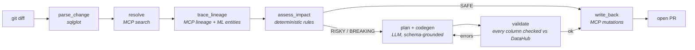

# Fuse

**The blast-radius agent for DataHub.** Fuse reads a schema change in your data repo, walks DataHub's lineage graph to find everything that actually breaks — including the feature tables and production ML models nobody remembers depend on that column — then generates the remediation code, opens a PR, and writes the verdict back into DataHub.

[](https://github.com/BriceZemba/fuse-datahub/actions/workflows/ci.yml)
[](LICENSE)

> Built for [Build with DataHub: The Agent Hackathon](https://datahub.devpost.com/).

---

## Quickstart — offline, no Docker, no API key

```bash
pip install -e .
```

```bash
fuse replay examples/01-drop-column
```

Replays a recorded run against committed fixtures and reproduces every artifact in `examples/01-drop-column/generated/`.

## Quickstart — in the cloud, no local Docker

[](https://codespaces.new/BriceZemba/fuse-datahub?quickstart=1)

The repo ships a devcontainer with Docker-in-Docker and the right machine size, so a full DataHub runs inside the codespace:

```bash
./scripts/bootstrap-datahub.sh
```

That starts DataHub, waits for GMS, and loads the `showcase-ecommerce` datapack. Ports 9002 (UI) and 8080 (GMS) are forwarded automatically. Stop the codespace when you are done — a 4-core machine spends 4 core-hours per running hour against the free monthly allowance.

## Quickstart — live against your own DataHub

```bash
datahub docker quickstart && datahub datapack load showcase-ecommerce
```

```bash
cp .env.example .env    # set DATAHUB_GMS_URL=http://localhost:8080 and your token
```

```bash
fuse doctor
```

```bash
fuse check --repo demo/dbt-shop --diff demo/scenarios/01-drop-column.patch
```

Add the ML half of the graph (the `showcase-ecommerce` datapack ships datasets, not models):

```bash
python demo/seed_ml_lineage.py
```

## Run it in CI

Copy [`.github/workflows/fuse.yml`](.github/workflows/fuse.yml) into any data repo. Fuse comments the impact table on the PR and fails the check when severity is `BREAKING`.

---

## How it works



Judgment is the LLM's job. Correctness is the code's job. Scores come from [`rules.yaml`](src/fuse/risk/rules.yaml) and every one is explained in the report. Full contracts in [ARCHITECTURE.md](ARCHITECTURE.md).

## What Fuse uses from DataHub

| DataHub capability | Node | Why |
|---|---|---|
| `search` | `resolve` | map a changed dbt model to its real URN |
| `list_schema_fields` | `resolve`, `codegen`, `validate` | ground generation on real columns; reject invented ones |
| `get_lineage`, `get_lineage_paths_between` | `trace_lineage` | downstream blast radius, multi-hop |
| fine-grained (column) lineage | `trace_lineage` | column-precise impact instead of table-level noise |
| `get_dataset_queries` | `assess_impact` | hard evidence that a consumer really selects the column |
| `get_entities` | `trace_lineage` | owners, tiers, domains, tags become risk inputs |
| ML entities (`mlFeature`, `mlModel`, `mlModelGroup`, deployments) | `assess_impact` | catch silent ML breakage |
| `add_tags`, `update_description`, `add_structured_properties` | `write_back` | the catalog records the verdict |
| `save_document` | `write_back` | the next agent inherits the analysis |

## How this differs from DataHub's built-in Skills

- The catalog Skills **find and describe**; Fuse **decides and repairs** — its output is code in a PR, not an answer in a chat.
- Fuse treats lineage as an **input to code generation**, grounding every generated identifier in the real schema and rejecting anything the catalog can't confirm.
- Fuse closes the loop: the analysis is **written back**, so the graph gets smarter after every change.

## Examples

See [examples/](examples/) — three complete recorded runs with inputs, analysis, generated artifacts and traces.

## Configuration

| Variable | Default | Purpose |
|---|---|---|
| `DATAHUB_GMS_URL` | `http://localhost:8080` | GMS endpoint (not the `:9002` UI) |
| `DATAHUB_GMS_TOKEN` | — | personal access token |
| `TOOLS_IS_MUTATION_ENABLED` | `true` | required for write-back |
| `FUSE_LLM_PROVIDER` | `none` | `anthropic` \| `openai` \| `ollama` \| `none` |
| `FUSE_HOPS` | `3` | lineage traversal depth |
| `FUSE_FAIL_ON` | `BREAKING` | severity that fails CI |
| `FUSE_DIALECT` | `snowflake` | sqlglot dialect |

With `FUSE_LLM_PROVIDER=none` the LLM nodes are skipped: strategy selection falls back to rules and generation to templates. Output is blunter, the pipeline still completes, and no API key is required.

## Commands

```bash
fuse check --repo <path> --diff <patch|rev|--staged> [--hops 3] [--dry-run] [--auto-approve]
```

```bash
fuse replay examples/01-drop-column
```

```bash
fuse doctor
```

## Limitations

- SQL parsing targets dbt-style models; dialect defaults to Snowflake and is configurable, but exotic macros are stripped rather than expanded.
- Column-level lineage depends on what your DataHub instance actually has. Without it, Fuse falls back to table-level dependency plus SQL evidence and says so in the report.
- Write-back needs `TOOLS_IS_MUTATION_ENABLED=true`; without it Fuse still analyses and generates, and reports the writes it skipped.
- Native assertions are a DataHub Cloud feature, so verdicts are recorded as tags, structured properties and documents instead.

## Development

```bash
pip install -e ".[dev]" && pytest -q
```

## License

Apache 2.0 — see [LICENSE](LICENSE).
